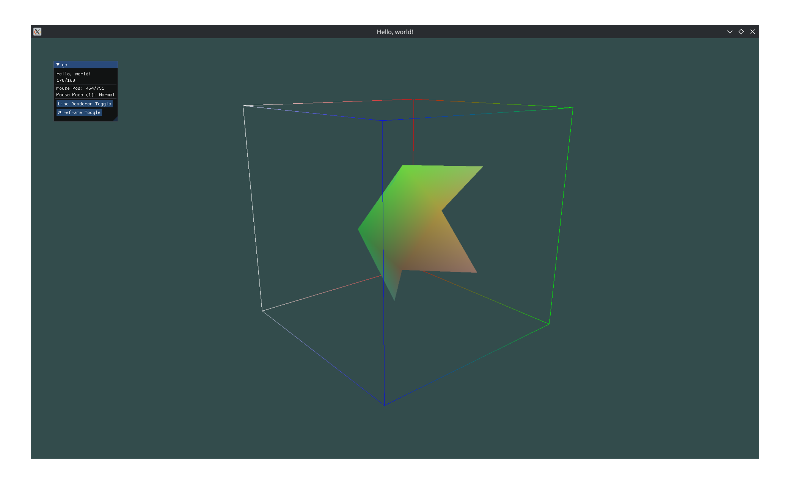

# GLFW Test

## Powered by [glfw](https://crates.io/crates/glfw) & [imgui-glfw-rs](https://crates.io/crates/imgui-glfw-rs)

A simple example of using OpenGL and ImGui in Rust.
 I also used [Learn OpenGL RS](https://github.com/bwasty/learn-opengl-rs) a rust port of [learnopengl.com](https://learnopengl.com)

**Includes:**
* Camera (WASD + Space/LShift)
* Line Renderer
* Shaders

**Todo:**
* Fix mouse capture
* ImGui .ini file crash

